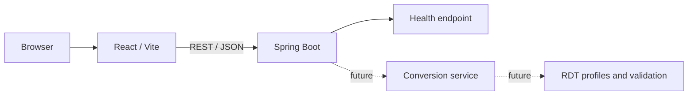

# AnyTone Codeplug Sandbox

## Overview

AnyTone Codeplug Sandbox is a local-first engineering project for analyzing and
eventually converting an AnyTone AT-D878UVII Plus codeplug into a functionally
equivalent AT-D168UV codeplug.

The current repository contains the validated full-stack foundation. Native RDT
conversion is planned but is not implemented yet. Format support will be added
only from controlled, sanitized binary evidence and validated against exact CPS
and firmware combinations.

This is an independent community project and is not affiliated with or endorsed
by AnyTone or its distributors.

## Key Features

Implemented now:

- React/Vite status workspace with loading, connected, and unavailable states.
- Spring Boot REST API with `GET /api/health`.
- Centralized frontend HTTP handling and safe backend error responses.
- Configurable, restricted local CORS.
- Frontend and backend automated tests, builds, and GitHub Actions CI.
- Architecture, handoff, security, and contribution documentation.

Planned:

- Version-specific read-only RDT inspection.
- Semantic compatibility analysis between the D878UVII Plus and D168UV.
- Conservative D168UV generation using a valid target CPS template.
- Auditable reports for preserved, adapted, unsupported, and blocking settings.

## Architecture



The applications are independently buildable and communicate through REST/JSON.
Processing is local and stateless; the design does not require a database or
external file service.

## Technology Stack

- Frontend: React 19, Vite 7, JavaScript, HTML5, CSS3
- Backend: Java 21, Spring Boot 4.1, Maven
- API: REST and JSON
- Testing: Vitest, React Testing Library, JUnit 5, Spring Boot Test, MockMvc
- Engineering: ESLint, Git, GitHub Actions, GitHub Copilot instructions

## Repository Structure

```text
.
|-- .github/       CI, templates, and Copilot instructions
|-- backend/       Spring Boot API and Maven Wrapper
|-- docs/          Architecture, operations, plans, and decisions
|-- frontend/      React/Vite application
|-- CHANGELOG.md
|-- CONTRIBUTING.md
|-- SECURITY.md
`-- README.md
```

## Getting Started

### Prerequisites

- Git
- Node.js 20.19+, 22.12+, or a newer supported LTS release
- npm
- Java 21 JDK

Maven does not need to be installed globally; the repository includes Maven
Wrapper scripts.

### Installation

```bash
git clone https://github.com/v-gmerello/AnyTone-Codeplugs-Sandbox.git
cd AnyTone-Codeplugs-Sandbox/frontend
npm ci
```

### Running Locally

Start the backend on Windows:

```powershell
cd backend
.\mvnw.cmd spring-boot:run
```

Start the frontend in another terminal:

```bash
cd frontend
npm run dev
```

Open [http://localhost:5173](http://localhost:5173). The backend listens on
[http://localhost:8080](http://localhost:8080).

## Testing

```bash
cd frontend
npm run lint
npm run test
npm run build
```

```powershell
cd backend
.\mvnw.cmd test
.\mvnw.cmd package
```

See [Testing](docs/TESTING.md) for test scope and conventions.

## Configuration

The frontend reads `VITE_API_URL`; the backend reads
`APP_CORS_ALLOWED_ORIGIN`. Development defaults connect ports 5173 and 8080.
Copy `frontend/.env.example` only when a local override is needed.

See [Configuration](docs/CONFIGURATION.md) for details.

## Documentation

Start at the [Documentation Index](docs/README.md). For development handoff,
read these files first:

1. [Current State](docs/CURRENT_STATE.md)
2. [Codebase Summary](docs/CODEBASE_SUMMARY.md)
3. [Implementation Plan](docs/IMPLEMENTATION_PLAN.md)
4. [Architecture](docs/ARCHITECTURE.md)

## Development Workflow

Use short-lived `feature/`, `fix/`, `refactor/`, or `docs/` branches and
Conventional Commits. Keep implementation, tests, and documentation synchronized.
See [Git Workflow](docs/GIT_WORKFLOW.md).

## Contributing

Read [CONTRIBUTING.md](CONTRIBUTING.md) before proposing changes. RDT format
claims require sanitized, reproducible evidence and exact version metadata.

## Security

Never publish personal codeplugs, DMR IDs, credentials, private frequencies, or
recovery data. Follow [SECURITY.md](SECURITY.md) for private reporting guidance.

## Versioning

The project follows Semantic Versioning and remains in `0.x.x` while interfaces
and supported radio profiles are experimental. See [Versioning](docs/VERSIONING.md).

## Roadmap

The roadmap progresses from the completed scaffold through controlled RDT
research, read-only profiles, compatibility planning, template-based output, and
physical validation. See [Roadmap](docs/ROADMAP.md).

## License

No software license has been selected. The [LICENSE](LICENSE) file is a
placeholder. An appropriate license must be chosen before public distribution.