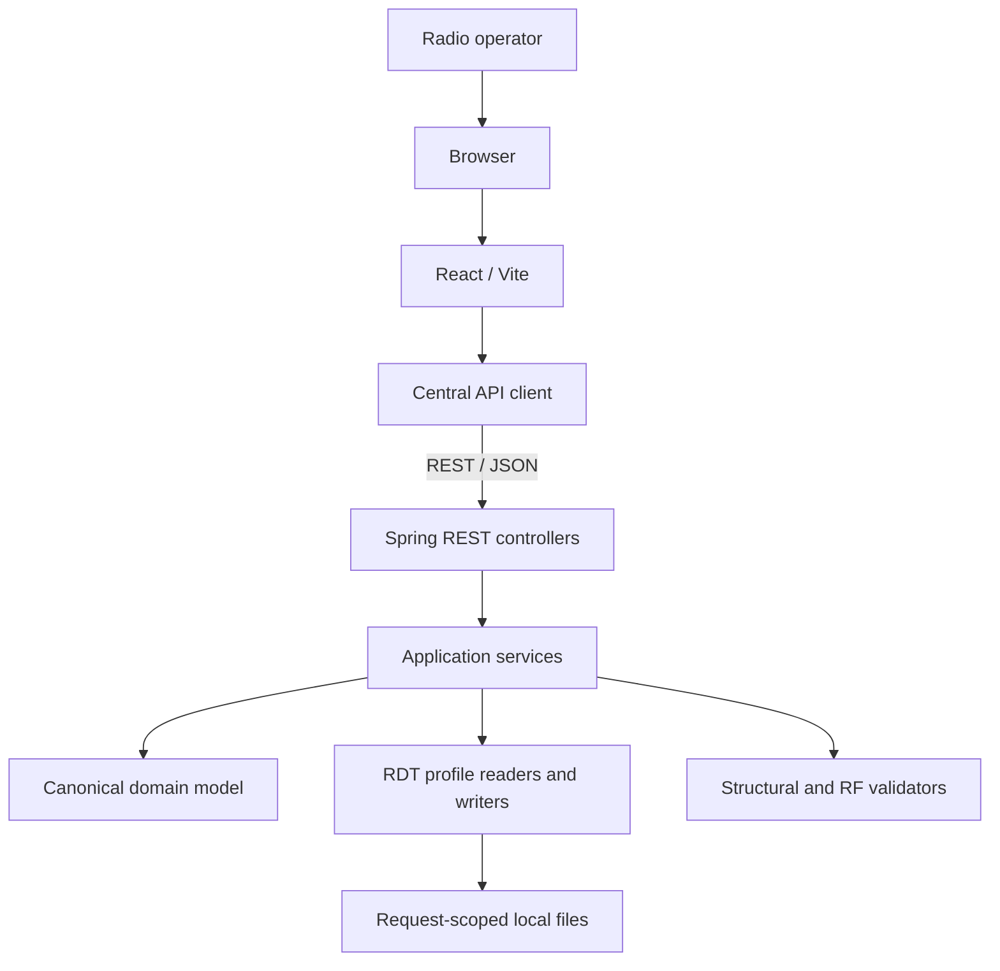
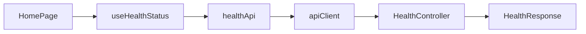
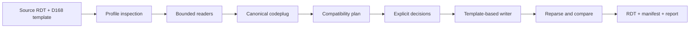

# Architecture

## System Context

AnyTone Codeplug Sandbox is designed as a local web application. The browser
provides the workflow and the Spring Boot process owns parsing, validation, and
future binary transformation. No remote service is required.



Only the health path through React, the API client, and a controller is
implemented. Dashed future concepts in other diagrams or prose are not current
functionality.

## Repository Architecture

The monorepo keeps frontend, backend, CI, and documentation in one revision.
Each application has its own build and dependencies. There is no root build
orchestrator; CI invokes each toolchain independently.

```text
repository
|-- frontend  React/Vite application
|-- backend   Spring Boot application
|-- docs      durable project knowledge
`-- .github   automation and collaboration policy
```

This structure makes API and documentation changes reviewable together without
coupling JavaScript and Maven dependency graphs.

## Frontend and Backend Boundary

The boundary is HTTP with JSON representations. The frontend must know endpoint
contracts, not backend classes. The backend must not serve or import frontend
source. During development, Vite and Spring Boot run on separate origins with a
single configured CORS allowlist entry.

## Dependency Direction

Frontend:

```text
pages -> features -> components
pages/features -> hooks -> services/api
```

Backend:

```text
controller -> service -> model / rdt / validation
```

Configuration and exception handling are cross-cutting adapters. Domain and
binary-format logic must remain independent of Spring MVC so it can be tested
without an HTTP context.

## Current Request Path



## Future Conversion Path



The writer may change only understood target regions. Unknown target-template
regions remain byte-for-byte unchanged. Unknown profiles or unresolved blocking
issues fail closed.

## Configuration Model

Configuration is externalized through environment variables with safe local
defaults. Vite exposes only variables prefixed with `VITE_`. Spring resolves
environment variables through `application.yml`. Secrets are neither required
nor stored in the repository.

Production configuration must explicitly set the browser origin. Wildcard CORS
is not an accepted production configuration.

## Testing Architecture

- Frontend component tests replace the health service at the API boundary.
- Backend context tests detect wiring failures.
- MockMvc tests validate HTTP status, content type, and JSON contracts.
- CI rebuilds from lockfiles and the Maven Wrapper on clean runners.
- Future RDT tests operate on minimal sanitized fixtures with an evidence
  manifest, golden semantics, malformed inputs, and property checks.

Physical validation follows automated validation: generated output must first
reparse, then open and save in the exact target CPS, then be written minimally
and read back from the radio.

## Security Boundaries

- Browser input is untrusted.
- The REST boundary validates type, size, content, and future multipart limits.
- RDT parsers must bounds-check every read and reject unknown profiles.
- Request content and personal identifiers are not logged.
- Processing is request-scoped and leaves no application database.
- API consumers receive stable safe errors, never server stack traces.
- RF-sensitive transformations require explicit validation and audit output.

Authentication is intentionally absent from the local scaffold. It must not be
added until a deployment and trust model exists.

## Future Extensibility

- Radio formats are added as explicit versioned profiles, not broad model-name
  guesses.
- The canonical model isolates semantic conversion from physical offsets.
- Capability rules isolate target limits from both readers and writers.
- REST versioning begins under `/api/v1` when conversion endpoints are added.
- Persistence, remote deployment, and authentication each require a separate
  architecture decision because they change the privacy model.