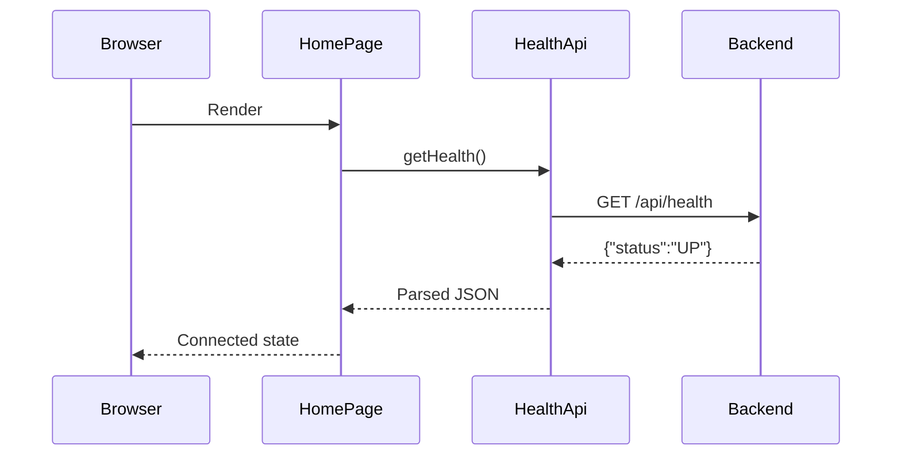

# Codebase Summary

## Application Purpose

The application is a local engineering workspace for future AnyTone
AT-D878UVII Plus to AT-D168UV codeplug conversion. The current implementation is
the full-stack scaffold and health integration only.

## Technology Stack

- React 19 and Vite 7 using JavaScript
- Java 21 and Spring Boot 4.1 using Maven
- REST/JSON
- Vitest, React Testing Library, JUnit 5, Spring Boot Test, and MockMvc
- ESLint and GitHub Actions

## Repository Layout

- `.github/` - CI, contribution templates, and Copilot rules.
- `frontend/` - browser application, tests, and API client.
- `backend/` - Spring Boot API, tests, configuration, and Maven Wrapper.
- `docs/` - durable architecture, operating knowledge, plans, and ADRs.
- Root Markdown - public onboarding, policy, contribution, and history.

## Frontend Architecture

`App.jsx` composes `AppLayout` and `HomePage`. `HomePage` calls
`useHealthStatus`, which uses `healthApi`, which delegates networking and error
parsing to `apiClient`. Presentation components receive state through props.

Dependency direction:

```text
pages -> features -> components
  |
  `-> hooks -> services/api
```

There is no router or global state library because the scaffold has one screen
and one request.

## Backend Architecture

`Application` starts Spring Boot. `HealthController` exposes the health DTO.
`WebConfiguration` owns CORS. `GlobalExceptionHandler` turns validation and
unexpected failures into safe JSON. No service or repository is needed for the
constant health contract; future business behavior must use those boundaries.

## Data Flow



## Important Components

- `AppLayout.jsx` - shared header, content, and footer frame.
- `HomePage.jsx` - route-level initial screen.
- `HealthStatusPanel.jsx` - accessible health-state presentation.
- `StatusBadge.jsx` - reusable text, icon, and color status indicator.

## Important Services

- `apiClient.js` - API base URL, JSON parsing, HTTP rejection, and `ApiError`.
- `healthApi.js` - health endpoint service.
- No backend business service exists yet.

## API Layer

The frontend uses `VITE_API_URL`, defaulting to
`http://localhost:8080/api`. The backend exposes `/api/health`; Actuator remains
under `/actuator`. API errors use stable codes and safe messages.

## Configuration

- `frontend/.env.example` documents `VITE_API_URL`.
- `backend/src/main/resources/application.yml` configures application identity,
  safe errors, Actuator exposure, and `APP_CORS_ALLOWED_ORIGIN`.
- Secrets must come from environment configuration and must not be committed.

## Testing Strategy

Frontend tests render the complete app and control the health service to cover
loading, success, and failure. Backend tests verify context startup and the
HTTP status/content contract through MockMvc. Future RDT tests require minimal
sanitized fixtures, golden expectations, and malformed-input cases.

## Security Model

The scaffold has no authentication because it has no user or remote data model.
The backend permits only one configured browser origin, suppresses stack traces
in responses, and exposes no secrets. Future uploads will be untrusted binary
input and must be bounded, profile-validated, stateless, and never logged.

## Dependency Rules

- React components do not call `fetch`.
- Frontend features may use shared components and API services; API services do
  not import UI modules.
- Backend controllers do not contain conversion logic.
- Domain/RDT modules must not depend on Spring MVC.
- No database, JPA, authentication, or external service is introduced without
  explicit scope and an ADR.

## Entry Points

- Frontend: `frontend/src/main.jsx`
- Backend: `backend/src/main/java/io/github/vgmerello/anytone/Application.java`

## Important Files

| File | Purpose | Dependencies |
| --- | --- | --- |
| `frontend/src/main.jsx` | Mounts React and global CSS | React DOM, `App` |
| `frontend/src/App.jsx` | Composition root | Layout and Home page |
| `frontend/src/services/api/apiClient.js` | HTTP and error boundary | Browser Fetch API |
| `backend/pom.xml` | Java build and managed dependencies | Spring Boot parent |
| `Application.java` | Spring Boot entry point | Spring Boot |
| `HealthController.java` | `/api/health` contract | `HealthResponse` |
| `WebConfiguration.java` | Restricted local CORS | Spring MVC |
| `GlobalExceptionHandler.java` | Safe JSON failures | Spring MVC, SLF4J |
| `.github/workflows/ci.yml` | Clean-room validation | GitHub Actions |

## How a Request Flows Through the System

```text
Browser
-> HomePage
-> useHealthStatus
-> healthApi
-> apiClient
-> HTTP GET /api/health
-> HealthController
-> HealthResponse JSON
```

Future conversion requests will continue from the controller through a
conversion service, profile-specific reader, canonical model, compatibility
planner, D168UV writer, and validators.

## Extension Points

- Add route-level screens under `frontend/src/pages/`.
- Add conversion workflow UI under `frontend/src/features/conversion/`.
- Add endpoint-specific network calls under `frontend/src/services/api/`.
- Add application orchestration under backend `service` packages.
- Add framework-independent domain types under backend `model` packages.
- Add profile-specific binary code under a future backend `rdt` package.
- Add structural and RF invariants under a future `validation` package.

## Things Developers Must Not Do

- Do not claim native RDT support before CPS and radio validation.
- Do not copy physical offsets or indices across models without evidence.
- Do not silently alter frequency, power, tone, Color Code, Time Slot, or
  Talkgroup values.
- Do not commit personal codeplugs, identifiers, credentials, or generated
  output.
- Do not add abstractions or dependencies solely to fill target directories.