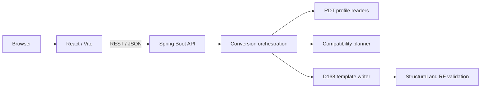

# Implementation Plan

## Objective

Build a local-first application that converts an AnyTone AT-D878UVII Plus
codeplug into a functionally equivalent AT-D168UV codeplug. The project will
first establish a production-quality React and Spring Boot foundation. Native
RDT conversion will then be developed from controlled binary evidence and
validated with the exact CPS and firmware combinations it supports.

"Equivalent" means preserving the source programming semantics within the
capabilities of the target radio. It does not mean producing a byte-identical
file or silently approximating unsupported settings.

## Scope

- GitHub-ready monorepo with a JavaScript React/Vite frontend and Java 21
  Spring Boot backend.
- REST/JSON integration and a health endpoint proving the complete stack.
- Automated linting, tests, builds, and GitHub Actions validation.
- Continuously maintained Markdown architecture and handoff documentation.
- Local, stateless processing with no codeplug uploaded to external services.
- Version-specific RDT readers for the D878UVII Plus and D168UV.
- A canonical codeplug model and compatibility report.
- Template-based D168UV RDT generation for the initial native converter.
- Initial conversion coverage for radio IDs, digital contacts, RX groups,
  channels, zones, and scan lists.
- Validation with sanitized fixtures, the target CPS, and physical radios.

## Out of Scope

- Application-specific conversion logic during repository scaffolding.
- USB communication with either radio.
- Firmware installation or modification of vendor CPS software.
- Synthesizing a D168UV RDT file without a valid target template.
- Database persistence, user accounts, authentication, or cloud storage.
- Generic support for unverified radio, firmware, or CPS versions.
- Roaming, APRS, GPS, Bluetooth, messages, key assignments, and full settings
  parity in the first converter release.
- TypeScript, JPA, Spring Security, containers, and cloud deployment.

## Architecture

The repository is a monorepo with two independently buildable applications:



The backend will remain stateless. Uploaded codeplugs are processed for one
request and are not persisted. The future RDT writer will copy a valid D168UV
template, modify only understood regions, recalculate its integrity data, and
parse the result again before returning it.

Frontend dependency direction:

```text
pages -> features -> components -> services/api
```

Backend dependency direction:

```text
controller -> service -> domain / rdt / validation
```

## Status Legend

- `NOT STARTED`: no implementation work has begun.
- `IN PROGRESS`: implementation or validation is active.
- `BLOCKED`: an external dependency or unresolved fact prevents safe progress.
- `COMPLETED`: deliverables and validation criteria are satisfied.

## Implementation Phases

### Phase 0 - Repository Assessment

**Status:** COMPLETED

**Objective:** Establish the factual baseline and protect existing work.

**Tasks:**

- Inspect the repository, Git metadata, branch, history, and visible secrets.
- Identify existing functionality and architectural constraints.
- Confirm product direction and initial RDT strategy.

**Files affected:**

- Existing `README.md` only; no application files existed.

**Dependencies:** None.

**Validation criteria:**

- Current branch and remote are known.
- Existing history remains intact.
- No valid implementation is replaced.
- No visible secret is incorporated into the plan.

**Result:** The repository contains one title-only README on `main`. The remote
is `v-gmerello/AnyTone-Codeplugs-Sandbox`. No application architecture exists
to preserve. Git is installed outside the terminal PATH; Node.js and Java 21
are not currently available in the terminal environment.

### Phase 1 - Repository Scaffolding

**Status:** COMPLETED

**Objective:** Create the repository foundation and development guardrails.

**Tasks:**

- Add ignore rules, editor settings, changelog, contribution policy, code of
  conduct, public security policy, and license placeholder.
- Establish `frontend/`, `backend/`, `docs/`, and `.github/` boundaries.
- Add GitHub issue templates, pull request template, and Copilot instructions.
- Record architecture decisions for the monorepo and local processing model.

**Files affected:**

- Root repository policy and metadata files.
- `.github/` configuration and templates.
- `docs/` index, plans, state documents, and ADRs.

**Dependencies:** Phase 0.

**Validation criteria:**

- Repository layout matches the documented architecture.
- Ignore rules cover secrets, local codeplugs, builds, logs, and IDE state.
- Markdown links resolve to real repository files.
- Documentation distinguishes implemented behavior from planned behavior.

### Phase 2 - Frontend Scaffolding

**Status:** COMPLETED

**Objective:** Provide a minimal accessible UI that validates backend health.

**Tasks:**

- Configure React and Vite using JavaScript only.
- Configure ESLint, Vitest, React Testing Library, and jsdom.
- Add a centralized API client using `VITE_API_URL` with a local fallback.
- Implement loading, connected, and unavailable health states.
- Add focused rendering and API-state tests.

**Files affected:** `frontend/` and `docs/FRONTEND.md`.

**Dependencies:** Phase 1 and an available supported Node.js runtime.

**Validation criteria:**

- `npm ci`, `npm run lint`, `npm run test`, and `npm run build` pass.
- React components do not call `fetch` directly.
- The initial UI contains no converter business functionality.

### Phase 3 - Backend Scaffolding

**Status:** COMPLETED

**Objective:** Provide a minimal layered API and operational baseline.

**Tasks:**

- Configure Spring Boot and Maven for Java 21.
- Use base package `io.github.vgmerello.anytone`.
- Add Spring Web, Validation, Actuator, and Spring Boot Test only.
- Implement `GET /api/health` returning `{"status":"UP"}`.
- Restrict local CORS to the configured frontend origin.
- Add centralized safe error handling and endpoint tests.

**Files affected:** `backend/`, `docs/BACKEND.md`, and `docs/API.md`.

**Dependencies:** Phase 1 and an available Java 21 runtime.

**Validation criteria:**

- `mvnw.cmd test` and `mvnw.cmd package` pass on Windows.
- The endpoint returns HTTP 200 and the documented JSON body.
- Controllers contain HTTP concerns only.
- No persistence, security framework, or business converter is introduced.

### Phase 4 - API Integration

**Status:** COMPLETED

**Objective:** Validate the browser-to-backend development path.

**Tasks:**

- Connect the Home page to the health API through the centralized client.
- Confirm local CORS and environment-based API configuration.
- Document request flow and failure behavior.

**Files affected:** Frontend API services, Home page, backend CORS configuration,
and API/configuration documentation.

**Dependencies:** Phases 2 and 3.

**Validation criteria:**

- The UI transitions through loading and connected states with the backend.
- An unavailable backend produces an accessible, actionable failure state.
- Production CORS is not unrestricted.

### Phase 5 - Testing

**Status:** COMPLETED

**Objective:** Establish behavior-focused automated regression protection.

**Tasks:**

- Cover frontend rendering, loading, success, and failure.
- Cover backend health status and JSON response.
- Document unit, component, integration, and future binary fixture strategies.

**Files affected:** Test sources and `docs/TESTING.md`.

**Dependencies:** Phases 2 through 4.

**Validation criteria:**

- Tests are deterministic and validate behavior rather than implementation
  details.
- Test commands work from a clean dependency installation.

### Phase 6 - Documentation

**Status:** COMPLETED

**Objective:** Make the repository resumable without conversation history.

**Tasks:**

- Complete architecture, development, configuration, testing, security,
  dependency, Git, CI, troubleshooting, roadmap, and versioning guides.
- Maintain `CURRENT_STATE.md`, `CODEBASE_SUMMARY.md`, this plan, and changelog.
- Add ADRs for monorepo architecture, local stateless processing, and future
  template-based RDT writing.

**Files affected:** `README.md`, `docs/`, and root policy documents.

**Dependencies:** Documentation follows the implementation it describes.

**Validation criteria:**

- A new developer can build, test, run, and extend the scaffold from docs.
- Current state is concise and factual.
- Planned RDT behavior is never presented as already implemented.

### Phase 7 - GitHub Integration

**Status:** COMPLETED

**Objective:** Prepare a professional public collaboration workflow.

**Tasks:**

- Add issue and pull request templates.
- Add repository-wide and path-specific Copilot instructions.
- Document branch, commit, review, security, and versioning conventions.

**Files affected:** `.github/`, `CONTRIBUTING.md`, and engineering docs.

**Dependencies:** Phases 1 and 6.

**Validation criteria:**

- Instruction frontmatter is valid YAML.
- Templates request testing, security, architecture, and documentation impact.
- No fabricated contact details, badges, or release claims are present.

### Phase 8 - CI Validation

**Status:** COMPLETED

**Objective:** Reproduce local quality gates on GitHub-hosted runners.

**Tasks:**

- Validate frontend install, lint, tests, and production build.
- Validate backend tests and package build using Java 21.
- Trigger on pushes to `main` and pull requests targeting `main`.

**Files affected:** `.github/workflows/ci.yml` and `docs/CI_CD.md`.

**Dependencies:** Phases 2, 3, and 5.

**Validation criteria:**

- Workflow syntax is valid and uses supported stable actions.
- Jobs do not deploy or require secrets.
- Local commands and CI commands agree.

**Result:** CI configuration and matching local gates are complete. The first
GitHub-hosted execution remains pending until the changes are pushed or opened
as a pull request.

### Phase 9 - Architecture Review

**Status:** COMPLETED

**Objective:** Verify that the initial scaffold is coherent and publishable.

**Tasks:**

- Review separation of concerns, dependency direction, configuration, security,
  testability, documentation accuracy, and Git hygiene.
- Remove dead scaffolding and resolve high-priority findings.
- Update handoff documents and changelog.

**Files affected:** Any scaffold file requiring a high-priority correction.

**Dependencies:** Phases 1 through 8.

**Validation criteria:**

- All local validation commands pass.
- No secrets or generated artifacts are tracked.
- Documentation matches the implementation.
- The initial scaffold contains no application-specific conversion logic.

**Result:** An independent read-only review found no blocking architecture or
security issues. Its documentation-status findings were reconciled, the future
fixture policy was added, and the ESLint configuration was corrected against
the installed React Hooks plugin before all local gates were rerun.

### Phase 10 - Controlled RDT Format Research

**Status:** BLOCKED

**Objective:** Derive the minimum safe, testable binary specifications for both
radios from controlled evidence.

**Tasks:**

- Obtain complete sanitized RDT samples and exact CPS, firmware, and region
  versions for each radio.
- Generate one-variable-at-a-time fixtures for each MVP entity and boundary.
- Build a binary diff analyzer and evidence ledger.
- Identify headers, records, occupancy maps, references, encodings, counters,
  and integrity algorithms.
- Build a versioned capability matrix.

**Files affected:** Future `docs/rdt/`, backend analysis tools, and sanitized
test fixtures.

**Dependencies:** Physical access to both radios and their exact CPS versions.

**Validation criteria:**

- Every writable field has reproducible evidence from controlled fixtures.
- The integrity mechanism and record references are understood.
- Real codeplugs and personal DMR data remain outside Git.

### Phase 11 - Read-Only RDT Profiles and Canonical Model

**Status:** NOT STARTED

**Objective:** Parse supported source and target formats without modifying data.

**Tasks:**

- Register profiles by model, format marker, CPS/firmware compatibility, and
  expected length.
- Implement bounded binary primitives and profile readers.
- Model identities, contacts, RX groups, channels, zones, and scan lists with
  explicit references.
- Reject truncated, corrupt, and unknown files safely.

**Dependencies:** Phase 10.

**Validation criteria:** Golden and negative fixture tests pass, and all reads
are bounds checked.

### Phase 12 - Compatibility Planning

**Status:** NOT STARTED

**Objective:** Produce a deterministic semantic conversion plan before writing
any target bytes.

**Tasks:**

- Map entities in dependency order and rebuild references semantically.
- Apply D168UV limits and detect truncation collisions.
- Classify results as preserved, adapted, requiring a decision, unsupported,
  or blocking.
- Block unsafe RF changes, structural invalidity, and unknown versions.

**Dependencies:** Phase 11.

**Validation criteria:** No field is silently discarded or changed, and every
mapping result includes its rule and reason.

### Phase 13 - Template-Based D168UV Writer

**Status:** NOT STARTED

**Objective:** Generate a target file while preserving unknown template data.

**Tasks:**

- Require and validate a D168UV template from the exact supported CPS profile.
- Modify only understood records, references, occupancy maps, and counters.
- Preserve unknown regions byte for byte.
- Recalculate integrity data, parse the output, and compare it to the plan.

**Dependencies:** Phases 10 through 12.

**Validation criteria:**

- Parse-write-parse is semantically stable and deterministic.
- Unknown regions remain unchanged.
- The exact D168UV CPS opens and saves a golden output without errors.

### Phase 14 - Converter API and UX

**Status:** NOT STARTED

**Objective:** Expose safe analysis, decision, and conversion workflows.

**Tasks:**

- Add stateless multipart analyze and convert endpoints under `/api/v1`.
- Enforce file size, header, profile, and content validation.
- Implement source/template selection, compatibility review, explicit
  decisions, final validation, and download in React.
- Return an RDT, manifest, hashes, and compatibility report.

**Dependencies:** Phase 13.

**Validation criteria:** A user cannot download output with unresolved blocking
issues, and temporary files and sensitive content are never logged or retained.

### Phase 15 - CPS and Radio Validation

**Status:** BLOCKED

**Objective:** Prove the generated result using vendor software and hardware.

**Tasks:**

- Open and save a minimal output in the exact D168UV CPS.
- Verify all RF and DMR settings before connecting the radio.
- Write a minimal codeplug, read it back immediately, and compare semantics.
- Expand gradually to an operational codeplug while retaining recovery backups.

**Dependencies:** Phase 14 and physical access to both radios.

**Validation criteria:** CPS acceptance, radio acceptance, semantic read-back,
and no unexpected RF parameter are all documented for an exact version profile.

### Phase 16 - Hardening and Incremental Parity

**Status:** NOT STARTED

**Objective:** Prepare a carefully scoped `0.x.x` release and add capabilities
without weakening evidence requirements.

**Tasks:**

- Add malformed-input, fuzz, property, capacity, performance, and security
  tests.
- Complete license selection, security contact, trademark disclaimer, and
  compatibility documentation before public distribution.
- Add roaming, APRS, GPS, Bluetooth, messages, keys, and settings one feature
  at a time through the same evidence and hardware-validation cycle.

**Dependencies:** Phase 15.

**Validation criteria:** Only exact, verified profiles are advertised as
supported, and each added capability has fixtures, automated tests, CPS tests,
and radio read-back evidence.

## Risks

- RDT is a proprietary, undocumented format; unidentified integrity or index
  rules can make generated files unsafe or unusable.
- The D168UV may have lower limits or different semantics than the D878UVII
  Plus, making complete equivalence impossible for some codeplugs.
- A file accepted by CPS can still contain unintended RF settings.
- Real codeplugs may expose DMR IDs, call signs, messages, frequencies, or other
  personal information.
- Git, Node.js, and Java are not available through the user's default terminal
  `PATH`. Local validation used temporary portable Node.js 24 and Java 21
  runtimes; persistent development still requires the documented toolchain.

## Assumptions

- The application runs locally and does not require accounts or persistence.
- The user will provide exact CPS and firmware versions with sanitized samples
  when physically near the radios.
- The initial target writer may require a fresh D168UV template for every exact
  supported profile.
- The official CPS remains the authority for opening and writing codeplugs to
  a radio.

## Decisions Required

- Select a software license before public distribution.
- Configure a private security reporting contact before public distribution.
- Confirm the exact CPS, firmware, and region combinations to support first.
- Confirm whether non-critical unsupported settings may be omitted after an
  explicit user decision; structural and RF safety failures will always block.

## Validation Checklist

- [x] Frontend dependencies install from a clean checkout.
- [x] Frontend lint, tests, and production build pass.
- [x] Backend tests and package build pass on Java 21.
- [x] Health integration works through configured local CORS.
- [ ] CI repeats all local validation gates.
- [x] No secrets, real codeplugs, personal data, or build artifacts are tracked.
- [x] Markdown links and diagrams render correctly.
- [x] Current state, codebase summary, plan, and changelog match the code.
- [ ] Every RDT rule is supported by sanitized fixtures and documented evidence.
- [ ] Generated RDT output passes parse-write-parse and integrity checks.
- [ ] The exact target CPS accepts the output before any radio write.
- [ ] Radio read-back matches the approved semantic conversion plan.

## Completion Criteria

The scaffold milestone is complete when both applications build and test, the
health integration works, CI is configured, repository governance is present,
documentation is synchronized, and no conversion business logic has been
introduced.

The converter MVP is complete only when a documented source profile can be
converted using a documented D168UV template profile, all changes are audited,
the exact CPS accepts the output, the radio accepts a minimal write, and the
read-back is semantically equivalent to the approved conversion plan.